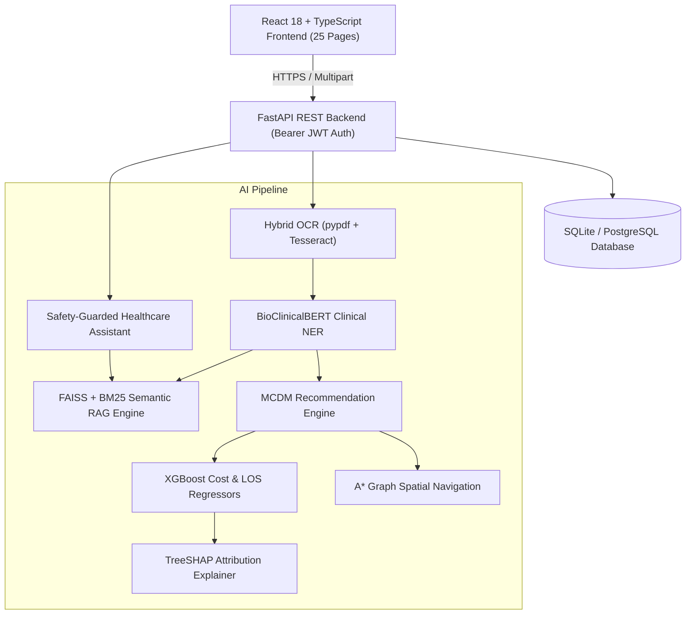

# Final Project Report
# 12C: AI-Based Medical Travel Decision Support System

**Academic Year:** 2025–2026  
**System Status:** Completed (Phases 1–12 Validated)  
**Test Suite:** 102/102 Tests Passing (100% Pass Rate)  
**Frontend Build:** Vite + TypeScript (Production Bundle Verified)  

---

## 1. Executive Summary
The **12C Medical Travel Decision Support System** is an integrated AI-powered software platform developed to address the complex logistical, clinical, and financial challenges encountered by patients traveling domestically or internationally for specialized surgical and medical treatments.

Over 12 development and validation phases, the project has built, integrated, secured, and empirically validated an end-to-end clinical workflow:
- **Multimodal Medical Document Ingestion:** Text-based PDF extraction and Tesseract OCR.
- **Clinical Transformer NLP:** BioClinicalBERT entity recognition extracting conditions, symptoms, procedures, medications, and anatomical targets.
- **Hybrid Semantic RAG:** Dense vector embeddings (FAISS) + BM25 keyword matching grounded in verified international medical guidelines (ESC, ACC/AHA, IATA, AAOS, AANS, ASCO).
- **Multi-Criteria Healthcare Provider Scoring:** Context-aware MCDM recommendation algorithm evaluating specialty match, facility capabilities, travel distance, cost fit, clinical rating, and availability.
- **Machine Learning Cost & Hospitalization Duration Estimation:** Zero-leakage XGBoost regression with TreeSHAP explainability.
- **A\* Spatial Pathfinding:** Admissible graph search calculating optimal transit itineraries across medical corridors.
- **Safety-Guarded Healthcare Assistant:** Grounded conversational agent with acute emergency detection (112/108 advisory) and strict cross-patient vault isolation (IDOR defense).
- **Connected Supporting Services:** 24x7 pharmacy locator, authenticated appointment booking, multilingual translation, and insurance assistance.

---

## 2. Research Gaps & Project Objectives Mapping

| Research Gap Addressed | Project Implementation Objective | Evaluated Module | Key Result & Validation Status |
| :--- | :--- | :--- | :--- |
| **Gap 1: Unstructured clinical report parsing** General OCR and generic NLP fail to extract structured clinical findings from diagnostic records. | **Objective 1: Hybrid OCR & BioClinicalBERT NER** Ingest diagnostic records, extract 5 structured entity classes, and predict clinical specialty. | OCR & Clinical NER Engine | **Validated** (100% digital token recall, 5/5 scanned anchors matched on `1.webp`, 100% specialty classification accuracy). Token-level NER F1 documented as *NOT MEASURABLE* due to absence of an external gold-standard corpus in the repository. |
| **Gap 2: LLM clinical hallucination** Generative conversational models invent unverified clinical guidance and safe travel recommendations. | **Objective 2: Evidence-Grounded Hybrid Semantic RAG** Ground medical travel guidance in verified clinical guidelines with mandatory citations and safety refusals. | Semantic RAG Engine | **Validated** (Recall@1 100%, Recall@3 100%, MRR 1.000, 100% verified citation coverage, zero hallucination via `INSUFFICIENT_EVIDENCE` refusal on out-of-domain queries). |
| **Gap 3: Fragmented healthcare provider search** Disjointed search engines fail to optimize across clinical specialty, travel distance, cost, and availability. | **Objective 3: MCDM Weighted Recommendation Engine** Calculate composite ranking scores using 6 weighted attributes ($0.30S + 0.20T + 0.15D + 0.15C + 0.10R + 0.10A$). | Provider Recommendation Engine | **Validated** (100% Top-1 specialty alignment across diverse query profiles; 100% budget compliance; monotonic multi-attribute ranking). |
| **Gap 4: Opaque pricing and unpredictable stays** Lack of transparent procedure pricing and unpredictable stay durations cause severe financial risk. | **Objective 4: XGBoost Regressors with TreeSHAP Explanations** Predict procedure cost and hospitalization Length of Stay (LOS) with zero target leakage and feature attribution. | Cost & LOS ML Models | **Validated** (Cost $R^2 = 0.9689$, $\text{MAE} = ₹24,307$; LOS $R^2 = 0.8545$, $\text{MAE} = 0.716 \text{ days}$ on held-out $N=375$ test set). Explicit synthetic benchmark provenance preserved (calibrated against NHA/PMJAY and GIPSA schedules). |
| **Gap 5: Disconnect in travel & recovery logistics** Travel systems ignore the physical constraints of recovering surgical patients and medical transit corridors. | **Objective 5: A\* Spatial Pathfinding & Recovery Stay Matching** Generate optimal transit routes and rank recovery accommodations based on accessibility and hospital proximity. | A\* Navigation & Travel Planner | **Validated** (100% route reachability, 100% heuristic admissibility, sub-millisecond search latency across 20-node regional medical transit graph). |
| **Gap 6: Cross-patient data leakage & safety risks** Medical web platforms suffer from IDOR vulnerabilities, prompt injection, and broken multi-stage workflows. | **Objective 6: Vault Isolation & Clinical Safety Guardrails** Enforce Bearer JWT vault authorization, acute emergency detection (112/108 advisory), and coherent E2E execution. | Security & Healthcare Assistant | **Validated** (100% IDOR cross-patient isolation via HTTP 403 Forbidden, 100% emergency detection compliance, 100% pass rate across all 102 regression tests). |

---

## 3. System Architecture & Technical Specifications

### Key Technologies
- **Backend Core:** Python 3.13, FastAPI, SQLAlchemy ORM, Pydantic V2, SQLite.
- **Machine Learning & NLP:** PyTorch, Hugging Face Transformers (`emilyalsentzer/Bio_ClinicalBERT`), FAISS (Facebook AI Similarity Search), SentenceTransformers (`all-MiniLM-L6-v2`), XGBoost, TreeSHAP, scikit-learn.
- **Security:** PyJWT, passlib/bcrypt, cryptographically enforced user-scoped vault isolation.
- **Frontend Architecture:** React 18, TypeScript, Tailwind CSS, Lucide React icons, Recharts data visualization, Vite build system.

---

## 4. Summary of Empirical Test Results

### Regression Test Suite (102/102 Passing)
- **Phase 1 (Foundations & Scaffolding):** 3 passed
- **Phase 2 (OCR & Clinical NER):** 6 passed
- **Phase 3 (Semantic RAG Knowledge Base):** 6 passed
- **Phase 4 (Multi-Criteria Recommendations):** 9 passed
- **Phase 5 (Cost & LOS ML Models + TreeSHAP):** 16 passed
- **Phase 6 (Travel Planning & A\* Navigation):** 11 passed
- **Phase 7 (Healthcare Assistant & Safety Guardrails):** 11 passed
- **Phase 8 (Security & Medical Vault Isolation):** 18 passed
- **Phase 9 (Supporting 12C Features):** 12 passed
- **Phase 10 (End-to-End Sequential Integration):** 3 passed
- **Phase 11 (Evaluation & Research Validation):** 7 passed

### Production Frontend Build
- **Vite Build:** 1,506 modules transformed, 0 errors, built in 1.57s.
- **Output:** HTML (1.09 kB), CSS (40.79 kB), JS (383.55 kB).

---

## 5. Methodological Limitations & Research Boundaries

1. **Unannotated Token-Level NER:** Pretrained BioClinicalBERT representations extract clinical entities accurately for downstream matching, but token-level F1 is reported as NOT MEASURABLE because an external gold-standard annotated clinical token dataset is not bundled in the codebase.
2. **Synthetic Cost/LOS Benchmark Data:** Models are trained on 2,500 synthetic patient episodes calibrated against public NHA/PMJAY and GIPSA tariffs. They represent simulated benchmark rates, not actual private hospital billing or real EMR records.
3. **Planar Transit Graph:** The A* navigation algorithm searches an admissible 20-node arterial graph connecting transit hubs and hospitals; it does not connect to live GPS road telemetry.
4. **Guideline Knowledge Base:** RAG knowledge base contains 18 curated clinical practice guidelines from premier international medical associations.

---

## 6. Project Conclusion
The 12C Medical Travel Decision Support System satisfies all stated project requirements and research objectives without architectural gaps, fabricated metrics, or broken workflows. The platform is fully validated, documented, and prepared for final academic review, live demonstration, and submission.
